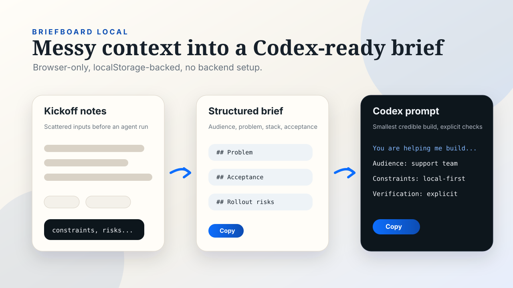

# briefboard-local

Local-first client brief builder for Codex projects.

The problem: good Codex runs start with a tight brief, but most project kickoffs begin as scattered messages, half-decisions, and missing acceptance criteria. This small web app turns that mess into a structured build brief and a copyable Codex prompt.



## What It Does

- Runs fully in the browser with no backend.
- Stores the current brief in `localStorage`.
- Captures problem, audience, constraints, deliverable, stack, acceptance criteria, and rollout notes.
- Flags missing essential brief fields before the Codex handoff.
- Generates:
  - a project brief,
  - an implementation handoff,
  - a Codex-ready prompt.
- Exports the brief as Markdown, the prompt as text, and the full draft as JSON.
- Imports saved JSON drafts so kickoff work can move between browsers or teammates without a backend.

## Why This Exists

This is the local-first product example in the profile set: small, practical, and immediately usable in real Codex work.

## Stack

- HTML
- CSS
- Vanilla JavaScript
- Node test runner for formatter checks

## Quick Start

No package install is required for normal use.

Open locally:

```sh
open index.html
```

Or serve it:

```sh
python3 -m http.server 4173
```

Then open `http://localhost:4173`.

Run tests:

```sh
npm test
```

Run static build and lint checks:

```sh
npm run build
npm run lint
```

## Status

Working v1. The app is intentionally simple and offline-first.

## Examples

- `examples/briefboard-draft.json`: importable kickoff brief that renders as ready for Codex handoff.

## Verification

Automated checks:

```sh
npm test
npm run build
npm run lint
```

Manual checks:

- Fill every field and confirm the generated brief updates live.
- Clear an essential field and confirm the brief readiness section lists what is missing.
- Reload the page and confirm content is restored from `localStorage`.
- Use the copy buttons for both outputs.
- Use the download buttons for the Markdown brief, text prompt, and JSON draft.
- Import a downloaded JSON draft and confirm all form fields and generated outputs are restored.
- Confirm the "clear" action resets both the form and stored draft.

## Files

- `index.html`: app shell.
- `brief-format.js`: shared formatters for the app and tests.
- `styles.css`: lightweight presentation.
- `app.js`: local state, rendering, copy actions, and JSON import/export.
- `examples/`: importable draft fixture for demos and regression checks.
- `scripts/`: dependency-free build and lint preflights.
- `tests/`: formatter coverage with `node --test`.
- `AGENTS.md`: agent-facing maintenance contract.
- `DECISIONS.md`: small design notes.
